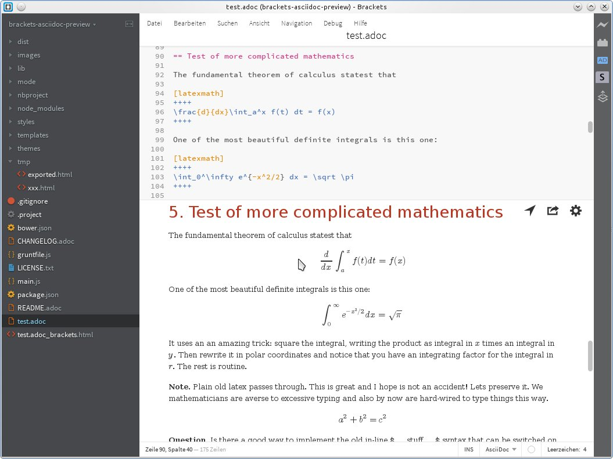
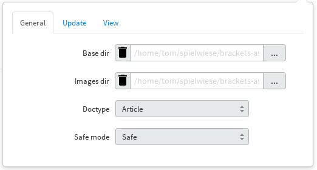
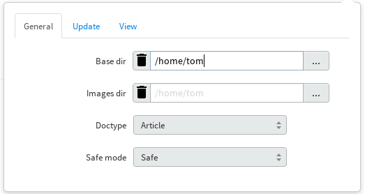
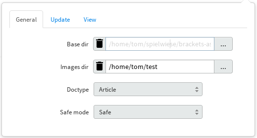
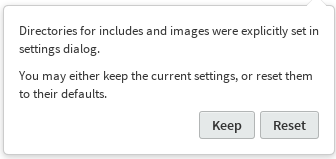

= AsciiDoc Live Preview for Adobe Brackets
Thomas Kern
:idprefix:
:idseparator: -
:experimental:

This is an extension for http://brackets.io[Adobe Brackets],
which allows for live preview of AsciiDoc documents. Rendered documents may also be exported to a
browser for printing or conversion to PDF.

== Installation

=== Released Version

Using the released version is the recommended way to install this extension.

From the Brackets file menu, open the extension manager. Browse available extensions and install 'AsciiDoc Preview'.

After installation, an additional icon appears in the Brackets toolbar to the right. If the name of the file currently edited 
ends with one of the suffixes '.adoc', '.ad', '.asciidoc', or '.asc', pressing this icon displays the preview pane.

In the upper right corner of the preview pane, pressing the gear symbol (image:styles/images/gear.svg[width=16]) opens the settings panel.

=== Development Version

In order to install the current development version, you need to have *npm* and *grunt-cli* installed. *npm* is 
the package manager of http://nodejs.org/[node.js]. After downloading and installing *node.js*, install
a system-wide version of *grunt-cli*:

----
npm install -g grunt-cli
----

Clone this repository and invoke the following commands from the project's toplevel directory:

----
npm install
grunt dist
----

This will create a zipfile in the current directory which can be installed from the Brackets extension 
manager by dropping the zipfile onto the input area in the dialog's lower left corner.

If you need to install previous versions of the plugin, you may do so by downloading a tagged release 
as a zipfile, unpack the zipfile and proceed in the same way as described above.

== MathJax Support

Rendering of mathematical expressions is supported by means of http://www.mathjax.org/[MathJax].
Unlike other components used by this plugin, MathJax is not included in the distribution,
but accessed via a CDN.

This means that you'll need a working internet connection in order to be able to see rendered expressions,
at least until MathJax was loaded and cached by Brackets for the first time.

The use of MathJax is disabled by default and must be switched on in the plugin's option panel (gear symbol in the preview pane)
by checking btn:[Render math]. See http://asciidoctor.org/news/2014/08/12/asciidoctor-1-5-0-released/#spotlight-mathjax[Get technical with MathJax].

WARNING: With MathJax enabled, the content of the preview pane will bounce during each refresh. 
It is therefore recommended that you only enable MathJax if really necessary. You may probably
also want to check btn:[Update on save] (see below). 

== Syncing the Preview Pane

It is possible to synchronize the current editing position in the editor with the corresponding part of the rendered HTML displayed by the preview pane.

After a document has been rendered successfully, pressing the location arrow symbol () scrolls that part of the HTML into view, which corresponds to the current text cursor position in the source document.

In addition, the settings panel provides an btn:[Auto-sync location] option. If this option is enabled, the preview pane will automatically synchronize its position with the part of the document currently being edited.

NOTE: Since synchronization works on the level of paragraphs and blocks, matching is not perfect. It is currently not possible to locate the correct location within a block, but only the start of the whole block. For example, if you are working with long tables or lists, the preview pane will display the start of the table or list, but the location you are editing might still be outside of the viewport. Synchronization will also not work for documents which include other documents.

IMPORTANT: If conversion of your document produced error or warning messages from Asciidoctor, information necessary for syncing isn't available. The location arrow will be hidden until the document has been fixed.

== Update-on-Save Option

Since larger documents take a while to be converted and displayed in the preview panel, 
it might be preferable to update the preview window not immediately when entering text. Instead, 
you may want to check btn:[Update on save] from the settings panel. This causes an update of the 
preview pane when pressing kbd:[Ctrl+S] or when saving the file through the menu.

== Export to Browser

A document displayed by the preview pane can be exported to a browser by pressing the export icon ().
If not already open, the default system browser is launched and the generated HTML document is displayed within a new browser tab. The browser
can then be used to save, convert, or print the document.

== Overriding Directory Settings

With Asciidoctor, files included in a master (top-level) document are resolved relative to the base directory, which defaults to the directory of the master document unless otherwise specified. When using Asciidoctor from the commandline, a base directory may be specified as a commandline option.

In addition, Asciidoctor also provides the built-in attribute named `imagesdir`. If this attribute is defined, included images are resolved relative to this directory instead of the base directory. In particular when editing documents included by a master document, the relative paths are usually broken and cannot be resolved correctly. Images are not shown in the preview pane or included files can not be found.

In order to resolve this, base and images directories may be specified from the settings dialog.

If no directories were set explicitly, base- and images directories default
to the directory of the document currently displayed. This is indicated 
by the light grey color of the paths displayed, as shown in the following screenshot:

After changing the base directory to `/home/tom`, the dialog looks as follows:

The base directory was explicitly set. This causes the *default of the images directory* to
be automatically changed to the same directory. As long as the images directory uses a default, any `imagesdir` attributes specified inside a document will still work as usual. 

However, if the images directory is explicitly set in the settings dialog,
all `ìmagesdir` attributes within the document are *ignored and forced* to the value specified in the dialog:

Document defaults may be restored by pressing the trashcan icon next to the input field.

If you switch to a document in a different directory, a warning message is displayed if 
base or the images directories were set.

You may either keep the settings as they are, or reset them to the new document's defaults.

== Known Issues

IMPORTANT: The following limitations only apply to documents displayed by the preview pane and *not* to the
actual conversion of a document with asciidoctor or when exporting the document to a browser.

* Preamble text directly following the title without an empty line in between is completely suppressed.
* In order to create
a TOC in your document, add attributes
+
----
:toc: 
:toc-placement: preamble
----
to the header of your document. Also make sure that your document
really has a preamble. Other values for +toc+ and +toc-placement+
attributes are currently not supported.

== Credits

The original version of this extension was based on Glenn Ruehle's https://github.com/gruehle/MarkdownPreview[Markdown preview extension], which I modified for AsciiDoc.

The actual formatting is performed by
https://github.com/asciidoctor/asciidoctor.js[Asciidoctor.js],
the JavaScript incarnation of http://asciidoctor.org/[Asciidoctor].

AsciiDoc mode for CodeMirror was created by 
Thaddee Tyl for https://github.com/espadrine/AsciiDocBox[AsciiDocBox], who
converted the highlighting mode from the Ace editor to CodeMirror.

Other software used:

* http://fortawesome.github.io/Font-Awesome/[Font Awesome 4.1.0] for font icons
* http://highlightjs.org/[highlight.js] for highlighting embedded source code
* http://www.mathjax.org/[MathJax] is a JavaScript display engine for mathematics

== Copyright and License

Copyright (C) 2014 Thomas Kern

Licensed under MIT License. See https://raw.githubusercontent.com/nerk/asciidoc-brackets-preview/master/LICENSE.txt[LICENSE] for details.

Based on _MarkdownPreview_, Copyright (C) 2012 Glenn Ruehle.

AsciiDoc mode Copyright (C) 2014 Thaddee Tyl <thaddee.tyl@gmail.com>

Arrow-, trash can, and export icons made by http://yanlu.de[Yannick] from http://www.flaticon.com[www.flaticon.com], licensed under http://creativecommons.org/licenses/by/3.0/[CC BY 3.0]

